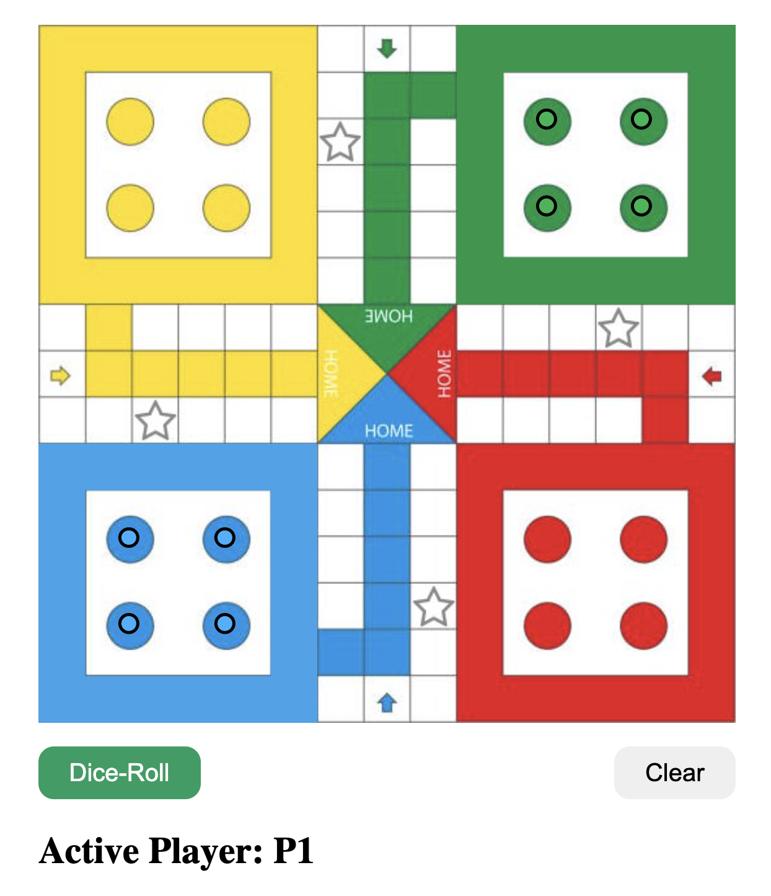

# LUDO-JS-ASSIGNMENT

## Description

This is a JavaScript implementation of the classic board game Ludo. It's a simple yet fun project showcasing basic game mechanics and UI interactions using HTML, CSS, and JavaScript.

## Features

- Roll the dice to move your pieces around the board.
- Implemented rules for safe zones, home entrances, and winning conditions.
- Supports two players.

## How to Play

1. Open the `index.html` file in your web browser.
2. Click the "Dice-Roll" button to roll the dice.
3. Move your pieces according to the dice roll and game rules.
4. Try to get all your pieces to the home position to win the game!

## File Structure

- `index.html`: Main HTML file containing the game layout.
- `style.css`: CSS file for styling the game interface.
- `main.js`: JavaScript file containing the game logic and UI interactions.
- `ludo`: Directory containing additional resources for the game.
  - `Ludo.js`: JavaScript class defining the Ludo game logic.
  - `UI.js`: JavaScript module for handling UI interactions.
  - `style.css`: CSS file for styling specific game elements.

## Development Setup

To set up the development environment:

1. Clone this repository to your local machine.
2. Open the `index.html` file in a web browser to play the game.
3. Make changes to the JavaScript files (`main.js`, `Ludo.js`, `UI.js`) to modify game behavior or add new features.

## Contributions

Contributions are welcome! If you have any ideas for improvements or find any issues, feel free to open an issue or submit a pull request.

## Credits

This project was created by [Your Name].
